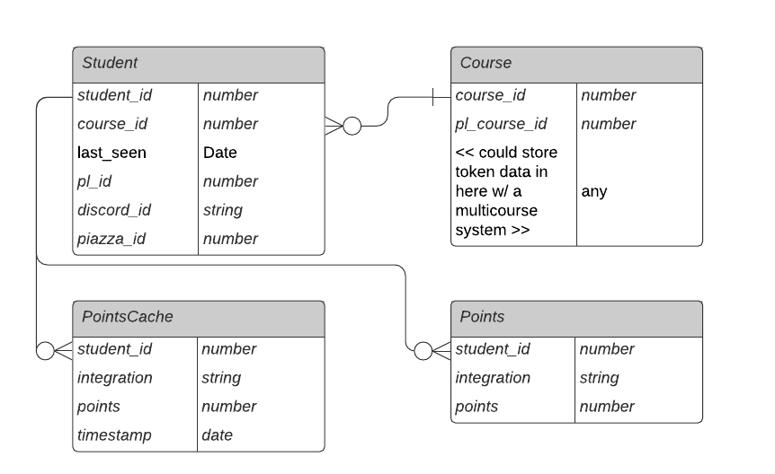

# And Dragons Architecture

## API

We've built a basic REST API to help retrieve data for our frontend. We do not have any authentication on this API.

### Endpoints

| Endpoint  | Description        | Response            |
| --------- | ------------------ | ------------------- |
| `/health` | Server liveliness. | `OK` (upon success) |

## Database

Our database is a mySQL database. We have tables for students, courses, integrations, points, and a cached "points" table. We have a good number of foriegn keys, and all fks have the `ON DELETE CASCADE` property--if the row that the fk references is deleted, all data using that as a fk also goes.

Every day at 1AM, our database runs a job to cache the "old" score data and dump it into a cached table. This lets us record meaningful metrics about student engagement over time.

### ER Diagram (Draft)

